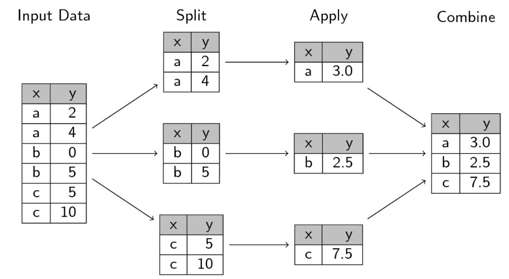
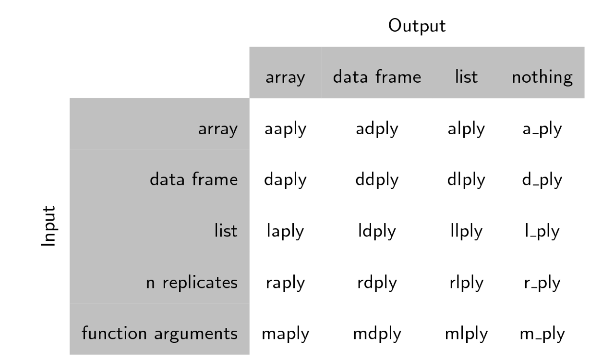

## Dataframe manipulation with `dplyr` - Software Carpentry Workshop


#### Agenda 

+ Big picture
+ Set up
+ Tools & Exercises 
+ Questions
+ Debrief  


>[link to R for Reproducible Scientific Analysis material](https://swcarpentry.github.io/r-novice-gapminder/12-plyr/index.html)


*heads up*: I tend to use a certain type of language while live coding 

+ function(argument) 

+ HINT: DATASET, COLUMN, VARIABLE, OBSERVATION


**note: feel free to ask questions at any point during the lesson**


### Big Picture

+ sometimes you need a lot of information to address your question

+ most times, all the information you need won't be in 1 dataframe

+ if you are working with multiple dataframes, you need to record where and how you combined them to get reproducible results


### Set Up

```{r setup, include=FALSE}

# necessary packages

# install.packages("plyr") for first timers!

library(plyr) # load package


# necessary dataframes

  # Dataframe 1 -- from Carpentry
gapminder <- read.csv("https://raw.githubusercontent.com/swcarpentry/r-novice-gapminder/gh-pages/_episodes_rmd/data/gapminder_data.csv", stringsAsFactors = TRUE) 


# as always, look at your data before manipulating it

str(gapminder)


```


### Tools & Exercises




**The plyr manta: split - apply - combine**

1. A *splitting* operation
2. *Apply* a function on each split in turn
3. *Recombine* output data as a single data object


But really, there are 9 core functions that follow XXply name structure

+ the functions are named based on data structure for input & output

+ *input* structure could be --> array, dataframe, list, n replicates, function arguments

+ *output* structure could be --> array dataframe, list, nothing




#### quick rules

XXply(.data, .variables, .fun)

+ first X is input, second X is output
+ .data -- data object to be processed
+ .variables -- identify splitting variables
```{r}

```


